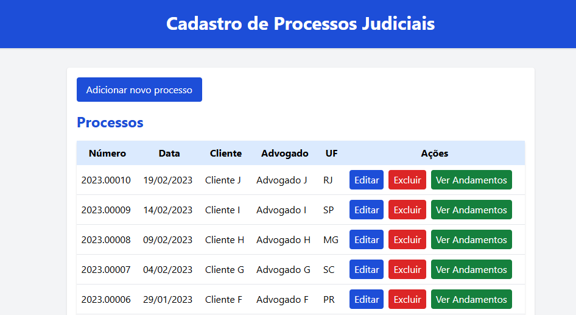
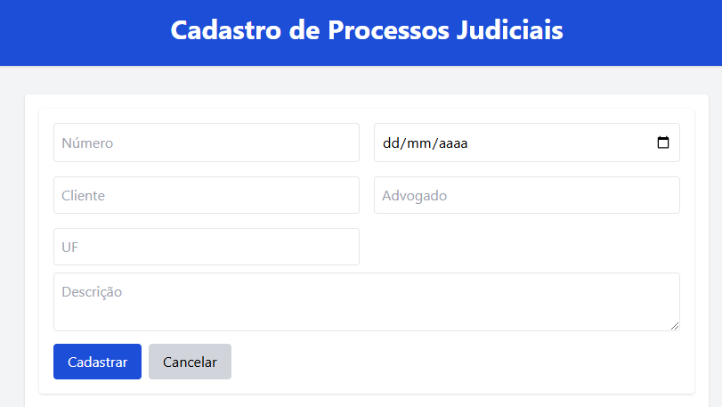
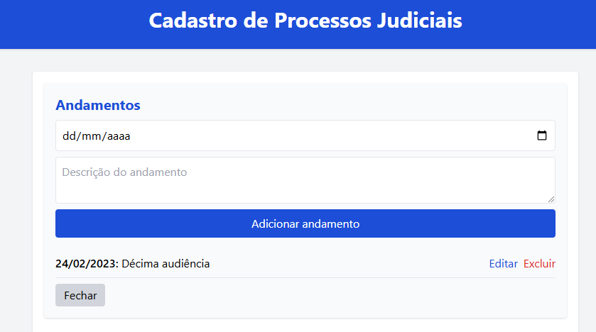

# ⚖️ Legal Proceedings Registration System

This project aims to implement a complete system for registering, editing and viewing **legal proceedings** and their **progress**, using modern technologies in the frontend and backend. The focus is on learning and applying fullstack development concepts with integration via REST API, relational database and Docker.

---

## 🚀 Technologies Used

- **React + Vite** → Modern framework for creating interfaces

- **TailwindCSS** → Modern and responsive styling

- **Node.js + Express** → Lightweight and scalable backend

- **PostgreSQL** → Robust relational database

- **Docker + Docker Compose** → Containerization and orchestration

- **React Toastify** → Success and error notifications

- **dotenv** → Environment variable management

---
## 📦 How to Run the Project with Docker

1. **Clone the repository**:
git clone https://github.com/your-user/judicial-system.git

2. **Access the project folder**:
cd judicial-system

3. **Upload the containers with Docker Compose**:
docker compose up --build

4. **Access in the browser:**

- Frontend: [http://localhost:3000](http://localhost:3000)
- Backend (API): [http://localhost:3001](http://localhost:3001)

🗂️ The database will be automatically populated with sample data using the `create_tables.sql` and `seeder.sql` files present in the project root.

---

## 🖼️ System Prints

### Home Page


### Process Registration Form


### Progress Registration Form


---

## 🛠️ Implemented Features

- ✅ Registration of new legal proceedings
- ✅ Editing of existing proceedings
- ✅ Registration of progress by process
- ✅ Editing and deleting progress
- ✅ Displaying success messages (via Toast)
- ✅ Responsiveness and usability

---

## 📈 Improvements Future

- [ ] User authentication (login)
- [ ] Process pagination and search
- [ ] Process document upload

---

## 📁 Project Structure

```
judicial-system/
├── backend/
│ ├── src/
│ ├── .env
│ ├── Dockerfile
├── frontend/
│ ├── src/
│ ├── .env
│ ├── Dockerfile
├── create_tables.sql
├── seeder.sql
├── docker-compose.yml
```
---

## 🤝 Contributing

Contributions are welcome!
1. Fork the project
2. Create a branch: `git checkout -b my-feature`
3. Commit your changes: `git commit -m 'feat: my new feature'`
4. Push to the remote repository: `git push origin my-feature`
5. Open a Pull Request

---

## 📫 Contact

- 📧 Email: [hudson.henri10@gmail.com](mailto:hudson.henri10@gmail.com)
- 💼 LinkedIn: [Hudson Henrique](https://www.linkedin.com/in/hudsonhenri)

---

## 📄 License

This project is under the MIT license. See the [LICENSE](LICENSE) file for more details.
